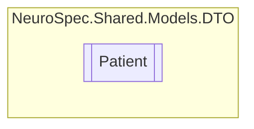

# Patient `Public class`

## Description
References Patient in FHIR

## Diagram


## Members
### Properties
#### Public  properties
| Type | Name | Methods |
| --- | --- | --- |
| [`Address`](./neurospecsharedmodelsdto-Address) | [`Address`](#address) | `get, set` |
| `Nullable`&lt;`int`&gt; | [`AssignedDoctorID`](#assigneddoctorid) | `get, set` |
| `DateTime` | [`DateOfBirth`](#dateofbirth) | `get, set` |
| `bool` | [`DominantHand`](#dominanthand)<br>True for right hand, false for left hand | `get, set` |
| `string` | [`Email`](#email) | `get, set` |
| `string` | [`FirstName`](#firstname) | `get, set` |
| `bool` | [`Gender`](#gender)<br>True for male, false for female | `get, set` |
| `double` | [`Height`](#height) | `get, set` |
| `string` | [`Id`](#id) | `get, set` |
| `string` | [`LastName`](#lastname) | `get, set` |
| `string` | [`Password`](#password) | `get, set` |
| `int` | [`PatientID`](#patientid) | `get, set` |
| `string` | [`PhoneNumber`](#phonenumber) | `get, set` |
| `string` | [`ProfilePicture`](#profilepicture) | `get, set` |
| `string` | [`ReferringDoctor`](#referringdoctor) | `get, set` |
| `string` | [`Username`](#username) | `get, set` |
| `double` | [`Weight`](#weight) | `get, set` |

## Details
### Summary
References Patient in FHIR

### Constructors
#### Patient
```csharp
public Patient()
```

### Properties
#### Id
```csharp
public string Id { get; set; }
```

#### PatientID
```csharp
public int PatientID { get; set; }
```

#### Username
```csharp
public string Username { get; set; }
```

#### Password
```csharp
public string Password { get; set; }
```

#### ReferringDoctor
```csharp
public string ReferringDoctor { get; set; }
```

#### AssignedDoctorID
```csharp
public Nullable<int> AssignedDoctorID { get; set; }
```

#### FirstName
```csharp
public string FirstName { get; set; }
```

#### LastName
```csharp
public string LastName { get; set; }
```

#### Email
```csharp
public string Email { get; set; }
```

#### PhoneNumber
```csharp
public string PhoneNumber { get; set; }
```

#### Address
```csharp
public Address Address { get; set; }
```

#### DateOfBirth
```csharp
public DateTime DateOfBirth { get; set; }
```

#### Gender
```csharp
public bool Gender { get; set; }
```
##### Summary
True for male, false for female

#### ProfilePicture
```csharp
public string ProfilePicture { get; set; }
```

#### Height
```csharp
public double Height { get; set; }
```

#### Weight
```csharp
public double Weight { get; set; }
```

#### DominantHand
```csharp
public bool DominantHand { get; set; }
```
##### Summary
True for right hand, false for left hand

*Generated with* [*ModularDoc*](https://github.com/hailstorm75/ModularDoc)
